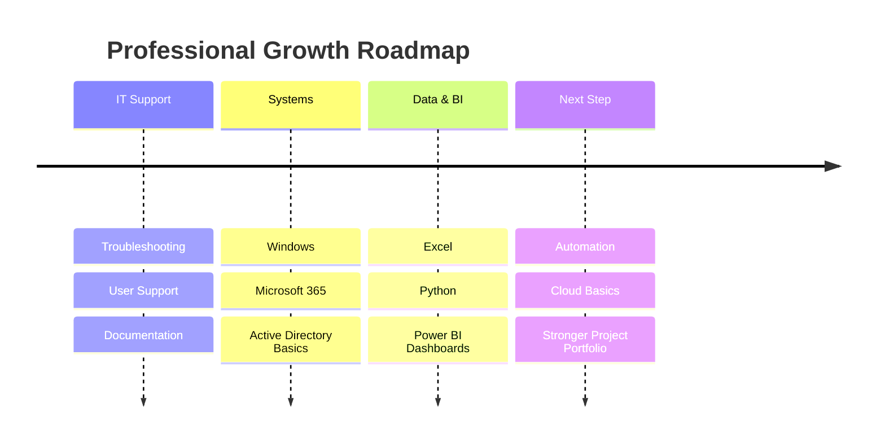

<!-- =====================================================
   Hani Mohamed Salah — Premium GitHub Profile README
   Modern • Interactive • Recruiter-Focused • GitHub Compatible
===================================================== -->

<!-- ================= ANIMATED HEADER ================= -->

  

  

<!-- ================= CONTACT BAR ================= -->

  
  
  
  

  
  
  

---

<!-- ================= QUICK VALUE PROPOSITION ================= -->

<table>
  <tr>
    <td width="60%" valign="top">
      <h2>Who I Am</h2>
      

        I am a Berlin-based IT professional focused on <b>IT support, system administration, technical documentation, process optimization, and data-driven reporting</b>.
      

      

        My strongest advantage is the combination of <b>IT operations</b> and <b>data/BI thinking</b>: I can support users, document systems, analyze business data, and turn messy information into useful dashboards and decisions.
      

      

        I am building toward roles in <b>IT Support, Junior System Administration, IT Operations, and BI / Reporting</b>.
      

    </td>
    <td width="40%" valign="top">
      <h2>Snapshot</h2>
      <ul>
        <li><b>Location:</b> Berlin, Germany</li>
        <li><b>Focus:</b> IT Support + Data/BI</li>
        <li><b>Tools:</b> Windows, M365, Power BI, Python</li>
        <li><b>Strength:</b> Troubleshooting + reporting</li>
        <li><b>Portfolio:</b> React / Vercel website</li>
      </ul>
    </td>
  </tr>
</table>

---

<!-- ================= INTERACTIVE NAVIGATION ================= -->

## Explore My Profile

  
<h3>IT Support & System Administration</h3>

   

  <table>
    <tr>
      <td width="33%" valign="top">
        <h4>User Support</h4>
        <ul>
          <li>1st / 2nd level troubleshooting</li>
          <li>Remote and on-site support</li>
          <li>Hardware and software setup</li>
          <li>User-focused communication</li>
        </ul>
      </td>
      <td width="33%" valign="top">
        <h4>Microsoft & Windows</h4>
        <ul>
          <li>Windows client support</li>
          <li>Microsoft 365 user support</li>
          <li>Active Directory basics</li>
          <li>Account and access support</li>
        </ul>
      </td>
      <td width="33%" valign="top">
        <h4>Networking Basics</h4>
        <ul>
          <li>TCP/IP fundamentals</li>
          <li>DNS / DHCP basics</li>
          <li>VPN connectivity</li>
          <li>Printer and workplace issues</li>
        </ul>
      </td>
    </tr>
  </table>

  
<h3>Data Analytics & BI</h3>

   

  <table>
    <tr>
      <td width="33%" valign="top">
        <h4>Power BI</h4>
        <ul>
          <li>KPI dashboards</li>
          <li>Business reporting</li>
          <li>Operational tracking</li>
          <li>Visual storytelling</li>
        </ul>
      </td>
      <td width="33%" valign="top">
        <h4>Excel</h4>
        <ul>
          <li>Data cleaning</li>
          <li>Business calculations</li>
          <li>Revenue and rent tracking</li>
          <li>Management reports</li>
        </ul>
      </td>
      <td width="33%" valign="top">
        <h4>Python</h4>
        <ul>
          <li>Pandas analysis</li>
          <li>Forecasting basics</li>
          <li>Data preparation</li>
          <li>Automation concepts</li>
        </ul>
      </td>
    </tr>
  </table>

  
<h3>Career Direction</h3>

   

  <table>
    <tr>
      <td width="50%" valign="top">
        <h4>Target Roles</h4>
        <ul>
          <li>IT Support Specialist</li>
          <li>1st / 2nd Level Support</li>
          <li>Junior System Administrator</li>
          <li>Fachinformatiker Systemintegration</li>
          <li>IT Operations Assistant</li>
          <li>BI / Reporting Assistant</li>
        </ul>
      </td>
      <td width="50%" valign="top">
        <h4>Current Learning Focus</h4>
        <ul>
          <li>Microsoft 365 administration</li>
          <li>Windows Server / AD workflows</li>
          <li>Power BI dashboard quality</li>
          <li>Python data projects</li>
          <li>Technical documentation</li>
          <li>Automation scripts</li>
        </ul>
      </td>
    </tr>
  </table>

---

<!-- ================= TECH STACK ================= -->

## Tech Stack

  

  
  
  
  
  
  

---

<!-- ================= SKILL MATRIX ================= -->

## Skill Matrix

<table>
  <tr>
    <td width="25%" align="center">
      <h3>Support</h3>
      
       
      
       
      
    </td>
    <td width="25%" align="center">
      <h3>Systems</h3>
      
       
      
       
      
    </td>
    <td width="25%" align="center">
      <h3>Data</h3>
      
       
      
       
      
    </td>
    <td width="25%" align="center">
      <h3>Workflow</h3>
      
       
      
       
      
    </td>
  </tr>
</table>

---

<!-- ================= PROJECTS ================= -->

## Featured Projects

<table>
  <tr>
    <td width="50%" valign="top">
      <h3>Automotive Demand Forecasting</h3>
      

        Python and BI-based forecasting concept for automotive parts demand, inspired by production planning and supply-chain workflows.
      

      
<b>Business value:</b> supports better stock planning, demand visibility, and operational decision-making.

      

        <code>Python</code> <code>Pandas</code> <code>Forecasting</code> <code>Power BI</code>
      

      

        
      

    </td>
    <td width="50%" valign="top">
      <h3>Business Operations Dashboard</h3>
      

        Power BI dashboard concept for rent, revenue, utilization, monthly planning, and operational KPI monitoring.
      

      
<b>Business value:</b> turns raw Excel business data into clear management reporting.

      

        <code>Power BI</code> <code>Excel</code> <code>Data Modeling</code> <code>KPI Reporting</code>
      

      

        
      

    </td>
  </tr>
  <tr>
    <td width="50%" valign="top">
      <h3>IT Support Toolkit</h3>
      

        Practical support notes, checklists, troubleshooting steps, and repeatable workflows for common IT support tasks.
      

      
<b>Business value:</b> improves support speed, consistency, and documentation quality.

      

        <code>Windows</code> <code>PowerShell</code> <code>Support</code> <code>Documentation</code>
      

      

        
      

    </td>
    <td width="50%" valign="top">
      <h3>Portfolio Website</h3>
      

        Personal portfolio website presenting IT, data, projects, skills, and professional background in a clean modern format.
      

      
<b>Business value:</b> gives recruiters a fast overview of skills, direction, and project credibility.

      

        <code>React</code> <code>Vercel</code> <code>UI Design</code> <code>Portfolio</code>
      

      

        
      

    </td>
  </tr>
</table>

---

<!-- ================= ROADMAP ================= -->

## Roadmap

---

<!-- ================= GITHUB STATS ================= -->

## GitHub Analytics

  

  
  

  

  

  

---

<!-- ================= RECRUITER CTA ================= -->

## For Recruiters

<table>
  <tr>
    <td width="33%" align="center">
      <h3>Fast Learner</h3>
      
I learn tools quickly and turn them into practical workflows.

    </td>
    <td width="33%" align="center">
      <h3>IT + Data</h3>
      
I combine technical support with reporting and business understanding.

    </td>
    <td width="33%" align="center">
      <h3>Reliable Execution</h3>
      
I document, troubleshoot, follow through, and improve processes.

    </td>
  </tr>
</table>

  
  
  
  

  <b>Berlin-based • IT Support • System Administration • Data Analytics • Power BI</b>

  

<!-- =====================================================
   IMPORTANT NOTES
   1. Replace every href="#" project link with real GitHub repo links.
   2. GitHub READMEs do not support custom JavaScript or full React interactivity.
   3. This version uses GitHub-compatible interactive elements: details, SVG animations, dynamic stats, badges, cards, and Mermaid.
   4. Phone number is public. Keep it only if you accept spam/cold calls.
===================================================== -->
