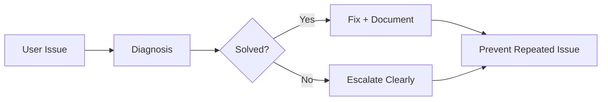
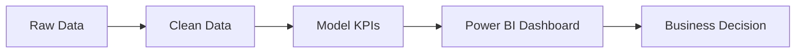
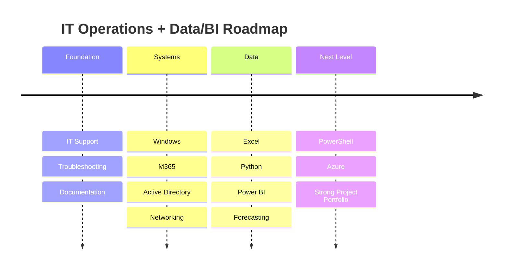

<!-- =====================================================
   Hany Mohamed Salah — Visual GitHub Profile README
   Dark Dashboard Style • Recruiter-Focused • GitHub-Compatible
===================================================== -->

<!-- ================= HERO / BANNER ================= -->

  

  

<!-- ================= CTA BADGES ================= -->

  
  
  
  

  
  
  
  
  

---

<!-- ================= VISUAL VALUE STRIP ================= -->

<table align="center" width="100%">
<tr>
<td align="center" width="25%">

 Troubleshoot • Analyze • Fix

</td>
<td align="center" width="25%">

 Reports • KPIs • Dashboards

</td>
<td align="center" width="25%">

 Documentation • Workflows

</td>
<td align="center" width="25%">

 Support • Communicate • Deliver

</td>
</tr>
</table>

---

<!-- ================= DASHBOARD STATS ================= -->

## Profile Dashboard

<table align="center" width="100%">
<tr>
<td width="25%" align="center">

### 4

Core Project Areas

`IT` `BI` `Forecasting` `Portfolio`

</td>
<td width="25%" align="center">

### 7

Certificates

`Google` `Microsoft` `SAP` `365 Data Science`

</td>
<td width="25%" align="center">

### 3

Main Tracks

`Support` `Systems` `Data`

</td>
<td width="25%" align="center">

### Berlin

Based in Germany

`IT Operations` `Data & BI`

</td>
</tr>
</table>

---

<!-- ================= TECH STACK VISUAL ================= -->

## Tech Stack

  

  
  
  
  
  
  

---

<!-- ================= COMPACT SKILLS MATRIX ================= -->

## Skill Matrix

<table align="center" width="100%">
<tr>
<td width="25%" valign="top" align="center">

### IT Support

</td>
<td width="25%" valign="top" align="center">

### Systems

</td>
<td width="25%" valign="top" align="center">

### Data & BI

</td>
<td width="25%" valign="top" align="center">

### Operations

</td>
</tr>
</table>

---

<!-- ================= FEATURED PROJECTS ================= -->

## Featured Projects

<table align="center" width="100%">
<tr>
<td width="25%" valign="top">

### Business Operations Dashboard

Power BI dashboard for revenue, rent, utilization, planning, and KPIs.

`Power BI` `Excel` `DAX`

</td>
<td width="25%" valign="top">

### Automotive Demand Forecasting

Python forecasting concept for automotive parts demand and supply planning.

`Python` `Pandas` `Time Series`

</td>
<td width="25%" valign="top">

### IT Support Toolkit

Troubleshooting guides, checklists, escalation notes, and reusable fixes.

`Windows` `M365` `Docs`

</td>
<td width="25%" valign="top">

### Portfolio Website

Modern recruiter-facing portfolio for skills, projects, and certificates.

`React` `Vercel` `UI`

</td>
</tr>
</table>

  

---

<!-- ================= CERTIFICATIONS VISUAL ================= -->

## Certifications

<table align="center" width="100%">
<tr>
<td align="center" width="25%">

 Power BI • 19/11/2024

</td>
<td align="center" width="25%">

 Python Forecasting • 19/11/2024

</td>
<td align="center" width="25%">

 Support Fundamentals • 30/09/2023

</td>
<td align="center" width="25%">

 Cloud + Security • 2023

</td>
</tr>
<tr>
<td align="center" width="25%">

 Data Analysis • 17/11/2024

</td>
<td align="center" width="25%">

 Cloud Services • 13/08/2023

</td>
<td align="center" width="25%">

 SAP Solution Design • 14/11/2023

</td>
<td align="center" width="25%">

 Data • Support • Cloud • SAP

</td>
</tr>
</table>

<b>Show certificate verification IDs</b>

 

| Certificate                                    | Provider             | Verification    |
| ---------------------------------------------- | -------------------- | --------------- |
| Power BI                                       | 365 Data Science     | `CC-D95DCD5209` |
| Time Series Analysis with Python               | 365 Data Science     | `CC-D73B26F17D` |
| Data Analysis with ChatGPT                     | 365 Data Science     | `CC-E68BD47ECB` |
| Technical Support Fundamentals                 | Google / Coursera    | `CEA625G223UC`  |
| Introduction to Microsoft Azure Cloud Services | Microsoft / Coursera | `DSY26NQHTAHY`  |
| Azure Management Tools and Security Solutions  | Microsoft / Coursera | `KLLLFVANSKXT`  |
| Designing an SAP Solution                      | SAP / Coursera       | `MWHWF2595ZEV`  |

---

<!-- ================= GITHUB VISUALS ================= -->

## GitHub Analytics

  
  

  

  

---

<!-- ================= INTERACTIVE WORKFLOWS ================= -->

## Interactive Workflows

<b>IT Support Workflow</b>

 

<b>BI Reporting Workflow</b>

 

<b>Professional Roadmap</b>

 

---

<!-- ================= CTA ================= -->

## Open to Opportunities

  
  
  

  
  
  

<!-- =====================================================
NOTES:
- Banner image must be named exactly: Hany Mohamed Salah.png
- Phone number intentionally removed.
- Replace href="#" project links with real repositories.
- GitHub README cannot run custom CSS/JS, so this uses GitHub-safe visuals.
===================================================== -->
