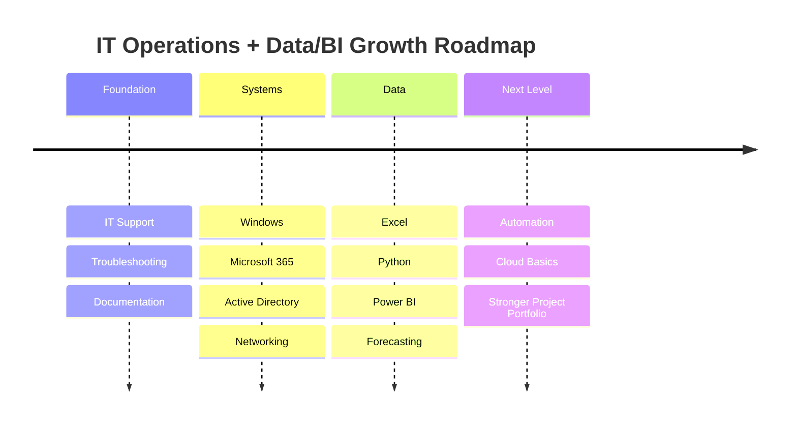

<!-- =====================================================
   Hani Mohamed Salah — Premium GitHub Profile README
   Modern • Interactive • Recruiter-Focused • GitHub Compatible
   IT Operations • System Support • Data & BI
===================================================== -->

<!-- ================= PREMIUM ANIMATED HERO ================= -->

  

  

  
  
  
  

  
  
  
  

---

<!-- ================= EXECUTIVE SUMMARY ================= -->

<table>
  <tr>
    <td width="62%" valign="top">
      <h2>IT Operations Profile</h2>
      

        I am a Berlin-based IT professional combining <b>technical support, system administration fundamentals, business process understanding, and data-driven reporting</b>.
      

      

        My value is not just answering tickets. I connect the dots between <b>users, systems, documentation, workflows, and business data</b> — the areas where many small and mid-sized companies lose time every day.
      

      

        I am focused on roles where I can support daily IT operations, improve internal processes, build clear documentation, and create dashboards that help teams make better decisions.
      

    </td>
    <td width="38%" valign="top">
      <h2>Professional Snapshot</h2>
      <ul>
        <li><b>Location:</b> Berlin, Germany</li>
        <li><b>Main Area:</b> IT Support / IT Operations</li>
        <li><b>Second Strength:</b> Data Analytics / BI</li>
        <li><b>Tools:</b> Windows, M365, Power BI, Excel, Python</li>
        <li><b>Working Style:</b> structured, practical, documentation-focused</li>
      </ul>
    </td>
  </tr>
</table>

---

<!-- ================= ROLE FIT ================= -->

## Role Fit

<table>
  <tr>
    <td width="25%" align="center" valign="top">
      <h3>IT Support</h3>
      
User support, troubleshooting, hardware/software setup, remote assistance, and clear ticket-style documentation.

    </td>
    <td width="25%" align="center" valign="top">
      <h3>System Admin</h3>
      
Windows environments, Microsoft 365, Active Directory basics, access support, DNS/DHCP/VPN fundamentals.

    </td>
    <td width="25%" align="center" valign="top">
      <h3>Data & BI</h3>
      
Excel analysis, Power BI dashboards, Python data cleaning, forecasting concepts, and KPI reporting.

    </td>
    <td width="25%" align="center" valign="top">
      <h3>Operations</h3>
      
Process improvement, documentation, business workflows, reporting structure, and practical problem-solving.

    </td>
  </tr>
</table>

---

<!-- ================= INTERACTIVE PROFILE ================= -->

## Interactive Profile

  
<h3>Technical Support & Workplace IT</h3>

   

  <table>
    <tr>
      <td width="33%" valign="top">
        <h4>User Support</h4>
        <ul>
          <li>1st / 2nd level troubleshooting</li>
          <li>Remote and on-site support</li>
          <li>Hardware and software setup</li>
          <li>Printer, account, and workplace issues</li>
        </ul>
      </td>
      <td width="33%" valign="top">
        <h4>Microsoft Environment</h4>
        <ul>
          <li>Windows client support</li>
          <li>Microsoft 365 user support</li>
          <li>Active Directory fundamentals</li>
          <li>User/account and permission workflows</li>
        </ul>
      </td>
      <td width="33%" valign="top">
        <h4>Technical Method</h4>
        <ul>
          <li>Structured troubleshooting</li>
          <li>Root-cause thinking</li>
          <li>Clear escalation notes</li>
          <li>Reusable support documentation</li>
        </ul>
      </td>
    </tr>
  </table>

  
<h3>Data Analytics, BI & Reporting</h3>

   

  <table>
    <tr>
      <td width="33%" valign="top">
        <h4>Power BI</h4>
        <ul>
          <li>Dashboard concepts</li>
          <li>KPI reporting</li>
          <li>Operational views</li>
          <li>Management-friendly visuals</li>
        </ul>
      </td>
      <td width="33%" valign="top">
        <h4>Excel</h4>
        <ul>
          <li>Data cleaning</li>
          <li>Revenue and rent tracking</li>
          <li>Monthly planning tables</li>
          <li>Business calculations</li>
        </ul>
      </td>
      <td width="33%" valign="top">
        <h4>Python</h4>
        <ul>
          <li>Pandas-based analysis</li>
          <li>Data preparation</li>
          <li>Forecasting basics</li>
          <li>Automation concepts</li>
        </ul>
      </td>
    </tr>
  </table>

  
<h3>What I Bring to a Team</h3>

   

  <table>
    <tr>
      <td width="50%" valign="top">
        <h4>Operational Value</h4>
        <ul>
          <li>Reduce repeated issues through better documentation</li>
          <li>Make support workflows easier to follow</li>
          <li>Translate technical problems into clear next steps</li>
          <li>Support daily IT stability and user productivity</li>
        </ul>
      </td>
      <td width="50%" valign="top">
        <h4>Business Value</h4>
        <ul>
          <li>Transform Excel data into readable reports</li>
          <li>Create dashboards for planning and decision-making</li>
          <li>Use data to identify trends, gaps, and priorities</li>
          <li>Bridge communication between technical and business sides</li>
        </ul>
      </td>
    </tr>
  </table>

  
<h3>Target Roles & Direction</h3>

   

  <table>
    <tr>
      <td width="50%" valign="top">
        <h4>Target Roles</h4>
        <ul>
          <li>IT Support Specialist</li>
          <li>1st / 2nd Level Support</li>
          <li>Junior System Administrator</li>
          <li>Fachinformatiker Systemintegration</li>
          <li>IT Operations Assistant</li>
          <li>BI / Reporting Assistant</li>
        </ul>
      </td>
      <td width="50%" valign="top">
        <h4>Current Development Focus</h4>
        <ul>
          <li>Microsoft 365 administration</li>
          <li>Windows Server and Active Directory workflows</li>
          <li>Power BI dashboard quality</li>
          <li>Python data analysis projects</li>
          <li>Technical documentation and automation</li>
        </ul>
      </td>
    </tr>
  </table>

---

<!-- ================= TECH STACK ================= -->

## Tech Stack

  

  
  
  
  
  
  

---

<!-- ================= TOOLBOX ================= -->

## Toolbox by Use Case

<table>
  <tr>
    <td width="25%" valign="top">
      <h3>Support</h3>
      
<code>Windows</code>

      
<code>Microsoft 365</code>

      
<code>Remote Support</code>

      
<code>Troubleshooting</code>

    </td>
    <td width="25%" valign="top">
      <h3>Systems</h3>
      
<code>Active Directory</code>

      
<code>DNS / DHCP</code>

      
<code>VPN</code>

      
<code>TCP/IP</code>

    </td>
    <td width="25%" valign="top">
      <h3>Data</h3>
      
<code>Power BI</code>

      
<code>Excel</code>

      
<code>Python</code>

      
<code>Pandas</code>

    </td>
    <td width="25%" valign="top">
      <h3>Workflow</h3>
      
<code>Documentation</code>

      
<code>Reporting</code>

      
<code>Process Optimization</code>

      
<code>Automation</code>

    </td>
  </tr>
</table>

---

<!-- ================= FEATURED PROJECTS ================= -->

## Featured Projects

<table>
  <tr>
    <td width="50%" valign="top">
      <h3>Automotive Demand Forecasting</h3>
      

        Python and BI-based forecasting concept for automotive parts demand, inspired by production planning and supply-chain workflows.
      

      
<b>Value:</b> supports better stock planning, demand visibility, and operational decision-making.

      
<b>Stack:</b> <code>Python</code> <code>Pandas</code> <code>Forecasting</code> <code>Power BI</code>

      

        
      

    </td>
    <td width="50%" valign="top">
      <h3>Business Operations Dashboard</h3>
      

        Power BI dashboard concept for rent, revenue, utilization, monthly planning, and operational KPI monitoring.
      

      
<b>Value:</b> turns raw Excel business data into clear management reporting.

      
<b>Stack:</b> <code>Power BI</code> <code>Excel</code> <code>Data Modeling</code> <code>KPI Reporting</code>

      

        
      

    </td>
  </tr>
  <tr>
    <td width="50%" valign="top">
      <h3>IT Support Toolkit</h3>
      

        Practical support notes, checklists, troubleshooting steps, and repeatable workflows for common IT support tasks.
      

      
<b>Value:</b> improves support speed, consistency, escalation quality, and documentation.

      
<b>Stack:</b> <code>Windows</code> <code>PowerShell</code> <code>Support</code> <code>Documentation</code>

      

        
      

    </td>
    <td width="50%" valign="top">
      <h3>Portfolio Website</h3>
      

        Personal portfolio website presenting IT, data, projects, skills, and professional background in a clean modern format.
      

      
<b>Value:</b> gives recruiters a fast overview of skills, direction, and project credibility.

      
<b>Stack:</b> <code>React</code> <code>Vercel</code> <code>UI Design</code> <code>Portfolio</code>

      

        
      

    </td>
  </tr>
</table>

---

<!-- ================= ROADMAP ================= -->

## Professional Roadmap

---

<!-- ================= GITHUB ANALYTICS ================= -->

## GitHub Analytics

  

  
  

  

  

  

---

<!-- ================= RECRUITER CTA ================= -->

## Why This Profile Is Useful to an Employer

<table>
  <tr>
    <td width="33%" align="center" valign="top">
      <h3>Support Mindset</h3>
      
I focus on solving user problems clearly, documenting what happened, and preventing repeated issues.

    </td>
    <td width="33%" align="center" valign="top">
      <h3>IT + Business Bridge</h3>
      
I understand both technical workflows and business reporting needs, which makes me useful beyond basic support.

    </td>
    <td width="33%" align="center" valign="top">
      <h3>Practical Execution</h3>
      
I work with structure: troubleshoot, document, report, improve, and keep daily operations moving.

    </td>
  </tr>
</table>

  
  
  
  

  <b>Berlin-based • IT Operations • System Support • Data Analytics • Power BI</b>

  

<!-- =====================================================
   NOTES
   1. Replace href="#" project links with real GitHub repo links.
   2. GitHub READMEs do not support custom JavaScript or full React components.
   3. This version uses GitHub-compatible interactivity: details sections, Mermaid, SVG animations, badges, cards, stats, and responsive tables.
   4. Phone number is public. Keep it only if you accept spam/cold calls.
===================================================== -->
