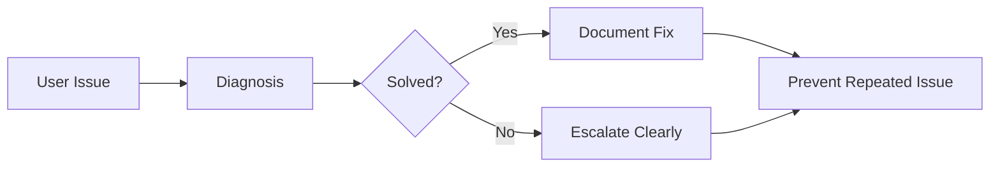
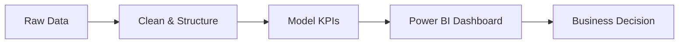

<!-- =====================================================
   Hany Mohamed Salah — Premium GitHub Dashboard README
   Dark • Green • Visual • Recruiter-Oriented • GitHub-Compatible
===================================================== -->

<!-- ================= MAIN VISUAL DASHBOARD ================= -->

  

<!-- ================= QUICK ACTIONS ================= -->

  
  
  
  

  
  
  
  
  

---

<!-- ================= VALUE STRIP ================= -->

<table align="center" width="100%">
<tr>
<td width="25%" align="center" valign="top">

### Problem Solver

Troubleshoot, analyze, fix, document.

</td>
<td width="25%" align="center" valign="top">

### Data Driven

Turn raw data into decisions.

</td>
<td width="25%" align="center" valign="top">

### Process Optimizer

Improve workflows and efficiency.

</td>
<td width="25%" align="center" valign="top">

### Team Player

Collaborate, support, deliver.

</td>
</tr>
</table>

---

<!-- ================= TECH STACK ================= -->

## Tech Stack

<table align="center" width="100%">
<tr>
<td align="center" width="10%">
 <b>Windows</b>
</td>
<td align="center" width="10%">
 <b>Microsoft 365</b>
</td>
<td align="center" width="10%">
 <b>Active Directory</b>
</td>
<td align="center" width="10%">
 <b>Power BI</b>
</td>
<td align="center" width="10%">
 <b>Python</b>
</td>
<td align="center" width="10%">
 <b>SQL / MySQL</b>
</td>
<td align="center" width="10%">
 <b>Git</b>
</td>
<td align="center" width="10%">
 <b>GitHub</b>
</td>
<td align="center" width="10%">
 <b>VS Code</b>
</td>
<td align="center" width="10%">
 <b>Jira</b>
</td>
</tr>
</table>

  
  
  
  

---

<!-- ================= ABOUT + STATS ================= -->

<table align="center" width="100%">
<tr>
<td width="34%" valign="top">

## About Me

I help organizations run smoother IT operations and make better decisions with data. My background combines hands-on IT support and system administration fundamentals with data analytics and BI reporting.

* IT Support & Troubleshooting
* System Administration & Microsoft 365
* Active Directory & Networking Basics
* Data Analysis with Python & Excel
* Power BI Dashboards & Reporting
* Documentation & Process Optimization

</td>
<td width="66%" valign="top">

## GitHub Stats

  
  

  

</td>
</tr>
</table>

---

<!-- ================= FEATURED PROJECTS ================= -->

## Featured Projects

<table align="center" width="100%">
<tr>
<td width="25%" valign="top">

### Business Operations Dashboard

Power BI dashboard for tracking rent, revenue, utilization, planning, and KPI performance.

`Power BI` `Excel` `DAX`

</td>
<td width="25%" valign="top">

### Demand Forecasting Analysis

Python-driven forecasting and analysis for automotive parts demand and supply-chain planning.

`Python` `Pandas` `Forecasting`

</td>
<td width="25%" valign="top">

### Sales & Performance Dashboard

Interactive Power BI dashboard for sales performance, targets, regions, and product analytics.

`Power BI` `Excel` `Data Modeling`

</td>
<td width="25%" valign="top">

### IT Support Toolkit

Collection of troubleshooting guides, scripts, checklists, and best practices for daily support tasks.

`Docs` `PowerShell` `Windows`

</td>
</tr>
</table>

  

---

<!-- ================= INTERACTIVE WORKFLOWS ================= -->

## Interactive Workflows

<b>IT Support Workflow</b>

 

<b>BI Reporting Workflow</b>

 

<b>System Support Areas</b>

 

<table width="100%">
<tr>
<td width="33%" valign="top">

#### Users

* Account support
* Access issues
* Remote help
* Clear communication

</td>
<td width="33%" valign="top">

#### Devices

* Windows clients
* Printer issues
* Software setup
* Workplace IT

</td>
<td width="33%" valign="top">

#### Network Basics

* DNS / DHCP
* VPN
* TCP/IP
* Connectivity issues

</td>
</tr>
</table>

---

<!-- ================= BOTTOM CARDS ================= -->

<table align="center" width="100%">
<tr>
<td width="33%" valign="top">

## Tools & Environments

* Windows 10 / 11
* Microsoft 365 / Outlook / Teams
* Active Directory basics
* DNS, DHCP, TCP/IP, VPN
* Remote support tools
* Power BI, Excel, Python

</td>
<td width="33%" valign="top">

## Achievements

* Consistent contributor mindset
* Problem-solving focus
* IT + data profile
* Documentation-first approach
* Business-oriented reporting

</td>
<td width="33%" valign="top">

## Currently Learning

* Advanced Power BI & DAX
* Azure fundamentals
* Python for data engineering
* Linux & server administration
* Automation with PowerShell

</td>
</tr>
</table>

---

<!-- ================= CTA ================= -->

<table align="center" width="100%">
<tr>
<td width="70%" valign="middle">

## Open to Opportunities

Open to **IT Support, System Administration, IT Operations, Data Analytics, and BI reporting roles** in Berlin and remote-friendly environments.

</td>
<td width="30%" align="center" valign="middle">

</td>
</tr>
</table>

  
  
  

<!-- =====================================================
IMPORTANT:
- Image file must be named exactly: Hany Mohamed Salah.png
- Phone number removed.
- Replace href="#" project links with real repository links.
- To look EXACTLY like the screenshot, export that design as one SVG/PNG and use it as the top image.
===================================================== -->
