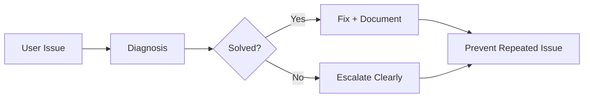
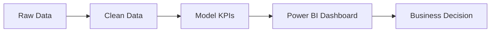
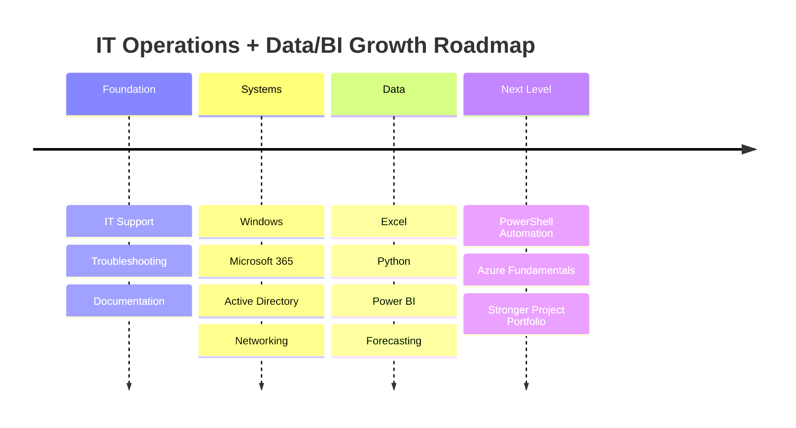

<!-- =====================================================
   Hany Mohamed Salah — Premium GitHub README
   IT Support • System Administration • Data & BI
   Dark Dashboard Style • Recruiter-Focused • GitHub-Compatible
===================================================== -->

<!-- ================= FULL-WIDTH BANNER ================= -->

  

<!-- ================= TYPING HEADER ================= -->

<h1 align="center">Hany Mohamed Salah</h1>

<h3 align="center">IT Support • System Administration • Data Analytics • Power BI</h3>

  

<!-- ================= CONTACT / CTA BADGES ================= -->

  
  
  
  

  
  
  
  
  

---

<!-- ================= VALUE CARDS ================= -->

<table align="center" width="100%">
<tr>
<td width="25%" align="center" valign="top">

### Problem Solver

Troubleshoot, analyze, fix, and document issues clearly.

</td>
<td width="25%" align="center" valign="top">

### Data Driven

Transform Excel and raw data into dashboards and decisions.

</td>
<td width="25%" align="center" valign="top">

### Process Optimizer

Improve workflows, documentation, and reporting structure.

</td>
<td width="25%" align="center" valign="top">

### Team Player

Support users, communicate clearly, and deliver practical results.

</td>
</tr>
</table>

---

<!-- ================= ABOUT + SNAPSHOT ================= -->

<table align="center" width="100%">
<tr>
<td width="58%" valign="top">

## About Me

I am a Berlin-based IT professional focused on **IT Support, System Administration, Microsoft 365, documentation, process optimization, Data Analytics, and Power BI reporting**.

My profile is built around a strong practical combination: **IT operations + data/BI thinking**. I can support users, document technical issues, improve internal workflows, analyze business data, and build dashboards that help teams make better decisions.

</td>
<td width="42%" valign="top">

## Professional Snapshot

| Area     | Focus                             |
| -------- | --------------------------------- |
| Location | Berlin, Germany                   |
| Core     | IT Support / IT Operations        |
| Systems  | Windows, Microsoft 365, AD basics |
| Data     | Power BI, Excel, Python           |
| Strength | Troubleshooting + Reporting       |
| Style    | Structured, practical, documented |

</td>
</tr>
</table>

---

<!-- ================= TECH STACK ================= -->

## Tech Stack

  

<table align="center" width="100%">
<tr>
<td align="center" width="10%">
 <b>Windows</b>
</td>
<td align="center" width="10%">
 <b>Azure</b>
</td>
<td align="center" width="10%">
 <b>Active Directory</b>
</td>
<td align="center" width="10%">
 <b>Power BI</b>
</td>
<td align="center" width="10%">
 <b>Python</b>
</td>
<td align="center" width="10%">
 <b>SQL / MySQL</b>
</td>
<td align="center" width="10%">
 <b>Git</b>
</td>
<td align="center" width="10%">
 <b>GitHub</b>
</td>
<td align="center" width="10%">
 <b>VS Code</b>
</td>
<td align="center" width="10%">
 <b>Jira</b>
</td>
</tr>
</table>

  
  
  
  
  

---

<!-- ================= CORE COMPETENCIES ================= -->

## Core Competencies

<table align="center" width="100%">
<tr>
<td width="25%" valign="top">

### IT Support

* 1st / 2nd level support
* Remote support
* User assistance
* Hardware/software setup
* Ticket-style documentation

</td>
<td width="25%" valign="top">

### System Administration

* Windows client support
* Microsoft 365 support
* Active Directory basics
* DNS / DHCP / TCP-IP
* VPN and network basics

</td>
<td width="25%" valign="top">

### Data & BI

* Power BI dashboards
* Excel reporting
* Python data analysis
* KPI design
* Forecasting concepts

</td>
<td width="25%" valign="top">

### Operations

* Documentation
* Process optimization
* Reporting workflows
* Business data structure
* Practical problem-solving

</td>
</tr>
</table>

---

<!-- ================= FEATURED PROJECTS ================= -->

## Featured Projects

<table align="center" width="100%">
<tr>
<td width="50%" valign="top">

### Automotive Demand Forecasting

Python-based demand forecasting concept for automotive parts planning and operational visibility.

**Value:** supports better stock planning, demand visibility, and supply-chain reporting.

**Stack:** `Python` `Pandas` `Time Series` `Forecasting` `Power BI`

</td>
<td width="50%" valign="top">

### Business Operations Dashboard

Power BI dashboard concept for rent, revenue, utilization, monthly planning, and operational KPI monitoring.

**Value:** turns Excel-based business data into clear management reporting.

**Stack:** `Power BI` `Excel` `DAX` `KPI Reporting` `Data Modeling`

</td>
</tr>
<tr>
<td width="50%" valign="top">

### IT Support Toolkit

Troubleshooting notes, support checklists, common fixes, escalation structure, and reusable documentation for daily IT tasks.

**Value:** improves support speed, consistency, and documentation quality.

**Stack:** `Windows` `Microsoft 365` `PowerShell` `Support Docs`

</td>
<td width="50%" valign="top">

### Personal Portfolio Website

Modern portfolio website presenting IT, data, projects, skills, certificates, and professional background.

**Value:** gives recruiters a fast overview of skills, direction, and project credibility.

**Stack:** `React` `Vercel` `UI Design` `Portfolio`

</td>
</tr>
</table>

  

---

<!-- ================= CERTIFICATIONS ================= -->

## Certifications

<table align="center" width="100%">
<tr>
<td width="50%" valign="top">

### Data & BI

| Certificate                      | Provider         | Date       |
| -------------------------------- | ---------------- | ---------- |
| Power BI                         | 365 Data Science | 19/11/2024 |
| Time Series Analysis with Python | 365 Data Science | 19/11/2024 |
| Data Analysis with ChatGPT       | 365 Data Science | 17/11/2024 |

</td>
<td width="50%" valign="top">

### IT, Cloud & Business Systems

| Certificate                                             | Provider             | Date       |
| ------------------------------------------------------- | -------------------- | ---------- |
| Technical Support Fundamentals                          | Google / Coursera    | 30/09/2023 |
| Introduction to Microsoft Azure Cloud Services          | Microsoft / Coursera | 13/08/2023 |
| Microsoft Azure Management Tools and Security Solutions | Microsoft / Coursera | 05/11/2023 |
| Designing an SAP Solution                               | SAP / Coursera       | 14/11/2023 |

</td>
</tr>
</table>

<b>Certificate IDs / Verification Details</b>

 

* **Data Analysis with ChatGPT** — 365 Data Science — Certificate ID: `CC-E68BD47ECB`
* **Time Series Analysis with Python** — 365 Data Science — Certificate ID: `CC-D73B26F17D`
* **Power BI** — 365 Data Science — Certificate ID: `CC-D95DCD5209`
* **Microsoft Azure Management Tools and Security Solutions** — Coursera verification: `KLLLFVANSKXT`
* **Technical Support Fundamentals** — Coursera verification: `CEA625G223UC`
* **Introduction to Microsoft Azure Cloud Services** — Coursera verification: `DSY26NQHTAHY`
* **Designing an SAP Solution** — Coursera verification: `MWHWF2595ZEV`

---

<!-- ================= INTERACTIVE WORKFLOWS ================= -->

## Interactive Workflows

<b>IT Support Workflow</b>

 

<b>BI Reporting Workflow</b>

 

<b>System Support Areas</b>

 

<table width="100%">
<tr>
<td width="33%" valign="top">

#### Users

* Account support
* Access issues
* Remote help
* Clear communication

</td>
<td width="33%" valign="top">

#### Devices

* Windows clients
* Printer issues
* Software setup
* Workplace IT

</td>
<td width="33%" valign="top">

#### Network Basics

* DNS / DHCP
* VPN
* TCP/IP
* Connectivity issues

</td>
</tr>
</table>

---

<!-- ================= GITHUB ANALYTICS ================= -->

## GitHub Analytics

  
  

  

  

---

<!-- ================= ROADMAP ================= -->

## Professional Roadmap

---

<!-- ================= CURRENTLY LEARNING ================= -->

## Currently Learning

<table align="center" width="100%">
<tr>
<td width="33%" valign="top">

### IT Systems

* Microsoft 365 administration
* Windows Server / AD workflows
* Linux basics
* Network troubleshooting

</td>
<td width="33%" valign="top">

### Data & BI

* Advanced Power BI
* DAX fundamentals
* Python for data analysis
* Forecasting and reporting

</td>
<td width="33%" valign="top">

### Automation & Cloud

* PowerShell automation
* Azure fundamentals
* Documentation systems
* Repeatable workflows

</td>
</tr>
</table>

---

<!-- ================= RECRUITER CTA ================= -->

## Open to Opportunities

<table align="center" width="100%">
<tr>
<td width="70%" valign="middle">

Open to **IT Support, System Administration, IT Operations, Data Analytics, and BI Reporting roles** in Berlin or remote-friendly environments.

</td>
<td width="30%" align="center" valign="middle">

</td>
</tr>
</table>

  
  
  

<!-- =====================================================
NOTES:
- Banner/image file must be named exactly: Hany Mohamed Salah.png
- Phone number intentionally removed.
- Replace href="#" project buttons with real repository links.
- Add real screenshots later only when you have strong dashboard/project visuals.
- GitHub README does not support full CSS/JS, so this uses GitHub-safe visual elements.
===================================================== -->
