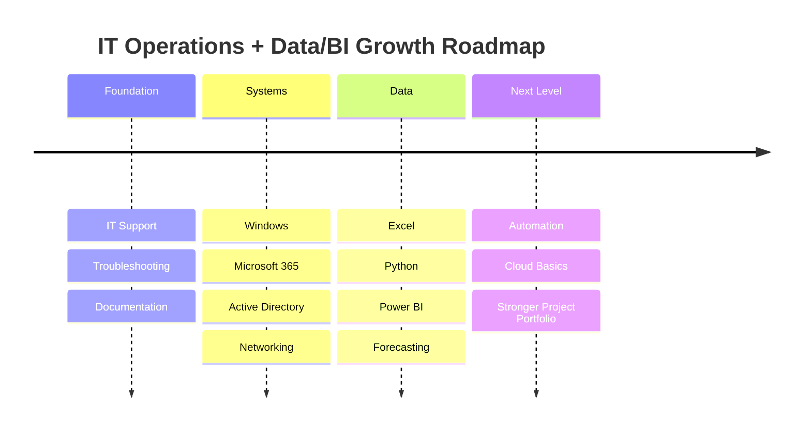

<!-- =====================================================
   Hany Mohamed Salah — ELITE GitHub Profile README
   Clean • Aligned • Visual • Interactive • Recruiter-Optimized
   GitHub-Compatible: No JavaScript Required
===================================================== -->

<!-- HERO -->

<p align="center">
  
</p>

<!-- PROFILE IMAGE -->

<p align="center">
  
</p>

<p align="center">
  
</p>

<!-- CONTACT ROW -->

<p align="center">
  <a href="https://hani-opal.vercel.app/"></a>
  <a href="mailto:hanymedsalah@gmail.com"></a>
  <a href="tel:+4915511360453"></a>
  <a href="https://www.linkedin.com/in/hanyy/"></a>
</p>

<p align="center">
  
  
  
  
</p>

---

<!-- VALUE STRIP -->

<p align="center">
  
  
  
</p>

---

<!-- EXECUTIVE SUMMARY -->

<table align="center">
<tr>
<td width="56%" valign="top">

## Profile

I am a Berlin-based IT professional focused on **IT Support, System Administration, Data Analytics, BI reporting, documentation, and process optimization**.

My strength is not only solving technical problems. I connect **users, systems, workflows, and data** so daily operations become clearer, faster, and easier to manage.

</td>
<td width="44%" valign="top">

## Snapshot

| Area     | Focus                             |
| -------- | --------------------------------- |
| Location | Berlin, Germany                   |
| Core     | IT Support / IT Operations        |
| Systems  | Windows, M365, AD basics          |
| Data     | Power BI, Excel, Python           |
| Style    | Structured, practical, documented |

</td>
</tr>
</table>

---

<!-- ROLE FIT -->

## Role Fit

<table align="center">
<tr>
<td width="25%" align="center" valign="top">

### IT Support

User support, troubleshooting, remote assistance, workplace IT, ticket-style documentation.

</td>
<td width="25%" align="center" valign="top">

### Systems

Windows, Microsoft 365, Active Directory basics, DNS, DHCP, VPN, access support.

</td>
<td width="25%" align="center" valign="top">

### Data & BI

Power BI dashboards, Excel reporting, Python analysis, KPI tracking, forecasting basics.

</td>
<td width="25%" align="center" valign="top">

### Operations

Documentation, process optimization, business workflows, reporting structure.

</td>
</tr>
</table>

---

<!-- VISUAL DASHBOARD SECTION -->

## Visual Work Areas

<table align="center">
<tr>
<td width="50%" valign="top">

### Operations Dashboard Concept

```text
Revenue Tracking     ████████████░░  82%
Occupancy / Usage    ██████████░░░░  74%
Monthly Planning     ███████████░░░  79%
Process Visibility   ██████████░░░░  72%
```

**Goal:** transform Excel-based business data into clear management dashboards.

</td>
<td width="50%" valign="top">

### IT Support Workflow Concept

```text
Incident Intake  →  Diagnosis  →  Fix / Escalate
       ↓              ↓              ↓
 Documentation  →  Root Cause  →  Prevention
```

**Goal:** reduce repeated issues through structured support documentation.

</td>
</tr>
<tr>
<td width="50%" valign="top">

### BI Reporting Focus

```text
Raw Data → Cleaning → Model → Dashboard → Decision
```

* KPI dashboards
* Monthly reports
* Forecasting concepts
* Management-friendly visuals

</td>
<td width="50%" valign="top">

### System Support Focus

```text
Users → Devices → Accounts → Network → Documentation
```

* Windows support
* M365 support
* AD basics
* DNS / DHCP / VPN basics

</td>
</tr>
</table>

---

<!-- INTERACTIVE SECTIONS -->

## Deep Dive

<details open>
<summary><b>IT Support & Systems</b></summary>
<br>

<table>
<tr>
<td width="33%" valign="top">

#### User Support

* 1st / 2nd level support
* Remote and on-site assistance
* Hardware/software setup
* Printer and workplace issues

</td>
<td width="33%" valign="top">

#### Microsoft Environment

* Windows client support
* Microsoft 365 support
* Active Directory basics
* Account and access workflows

</td>
<td width="33%" valign="top">

#### Troubleshooting Method

* Structured diagnosis
* Clear escalation notes
* Root-cause thinking
* Reusable documentation

</td>
</tr>
</table>

</details>

<details>
<summary><b>Data Analytics & BI</b></summary>
<br>

<table>
<tr>
<td width="33%" valign="top">

#### Power BI

* Dashboard concepts
* KPI reporting
* Operational views
* Management visuals

</td>
<td width="33%" valign="top">

#### Excel

* Data cleaning
* Business calculations
* Revenue/rent tracking
* Monthly planning tables

</td>
<td width="33%" valign="top">

#### Python

* Pandas analysis
* Data preparation
* Forecasting basics
* Automation concepts

</td>
</tr>
</table>

</details>

<details>
<summary><b>Professional Direction</b></summary>
<br>

<table>
<tr>
<td width="50%" valign="top">

#### Target Roles

* IT Support Specialist
* 1st / 2nd Level Support
* Junior System Administrator
* Fachinformatiker Systemintegration
* IT Operations Assistant
* BI / Reporting Assistant

</td>
<td width="50%" valign="top">

#### Current Development

* Microsoft 365 administration
* Windows Server / AD workflows
* Power BI dashboard quality
* Python data projects
* Technical documentation
* Automation scripts

</td>
</tr>
</table>

</details>

---

<!-- TECH VISUAL -->

## Tech Stack

<p align="center">
  
</p>

<p align="center">
  
  
  
  
  
  
</p>

---

<!-- PROJECT CARDS -->

## Featured Projects

<table align="center">
<tr>
<td width="50%" valign="top">

### Automotive Demand Forecasting

Python-based demand forecasting concept for automotive parts planning and operational visibility.

**Value:** supports better stock planning, demand visibility, and reporting.

`Python` `Pandas` `Forecasting` `Power BI`

<a href="#"></a>

</td>
<td width="50%" valign="top">

### Business Operations Dashboard

Power BI dashboard concept for revenue, rent, utilization, planning, and operational KPIs.

**Value:** turns Excel data into clear management reporting.

`Power BI` `Excel` `Data Modeling` `KPI Reporting`

<a href="#"></a>

</td>
</tr>
<tr>
<td width="50%" valign="top">

### IT Support Toolkit

Troubleshooting notes, checklists, support workflows, and reusable documentation for common IT tasks.

**Value:** improves support speed, consistency, and escalation quality.

`Windows` `Support` `PowerShell` `Documentation`

<a href="#"></a>

</td>
<td width="50%" valign="top">

### Portfolio Website

Modern portfolio website presenting IT, data, projects, skills, and professional background.

**Value:** gives recruiters a fast overview of profile and direction.

`React` `Vercel` `UI Design` `Portfolio`

<a href="https://hani-opal.vercel.app/"></a>

</td>
</tr>
</table>

---

<!-- DASHBOARD PLACEHOLDERS -->

## Dashboard & Project Screenshots

> Replace these placeholders with real screenshots when your dashboards are ready. This section is what will make the profile look truly premium.

<table align="center">
<tr>
<td width="50%" align="center">

### Power BI Dashboard


</td>
<td width="50%" align="center">

### Forecasting Report


</td>
</tr>
<tr>
<td width="50%" align="center">

### IT Support Documentation


</td>
<td width="50%" align="center">

### Portfolio Preview


</td>
</tr>
</table>

---

<!-- ROADMAP -->

## Professional Roadmap



---

<!-- GITHUB ANALYTICS -->

## GitHub Stats

<p align="center">
  
  
</p>

<p align="center">
  
</p>

<p align="center">
  
</p>

---

<!-- RECRUITER CTA -->

## Why This Profile Is Useful to an Employer

<table align="center">
<tr>
<td width="33%" align="center" valign="top">

### Support Mindset

I focus on solving user problems clearly, documenting what happened, and preventing repeated issues.

</td>
<td width="33%" align="center" valign="top">

### IT + Business Bridge

I understand both technical workflows and business reporting needs, which makes me useful beyond basic support.

</td>
<td width="33%" align="center" valign="top">

### Practical Execution

I troubleshoot, document, report, improve, and keep daily operations moving.

</td>
</tr>
</table>

---

<!-- CTA -->

## Let’s Work Together

<p align="center">
  <a href="mailto:hanymedsalah@gmail.com"></a>
  <a href="tel:+4915511360453"></a>
  <a href="https://www.linkedin.com/in/hanyy/"></a>
  <a href="https://hani-opal.vercel.app/"></a>
</p>

<p align="center">
<b>Berlin • IT Support • System Administration • Data Analytics • Power BI</b>
</p>

<p align="center">
  
</p>

<!-- =====================================================
FINAL NOTES:
- Image file must be named exactly: Hany Mohamed Salah.png
- Replace href="#" with real project repository links.
- Replace placeholder dashboard images with real screenshots later.
- GitHub README does not support custom JS/React, so this uses GitHub-safe interactivity.
===================================================== -->
